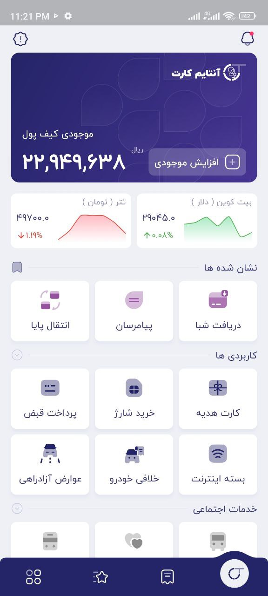
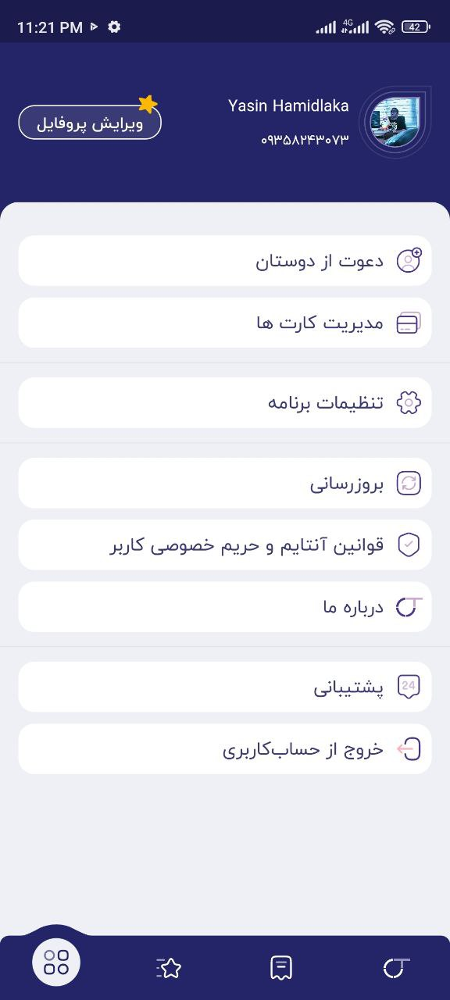
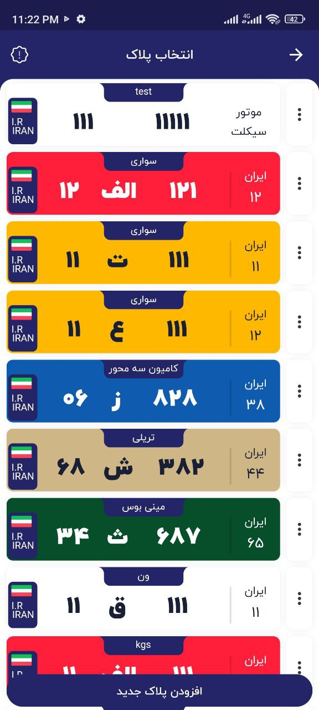

# Ontime24
Intro page for Ontime24 application   
You can download the APK file from [this](https://github.com/mrYasinHamidi/Ontime24/releases/download/0.1.15/ontime24.apk) link.

  
  
  
  
  
  
  
  

